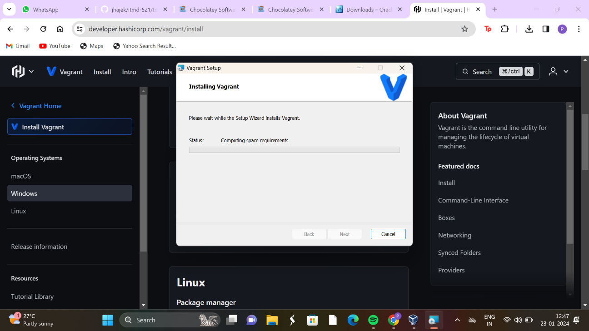

# installing Chocolatey:

# installing Git Client:

# Virtual Box 

# installing Virtual Box:

# installing Packer:

# Oh-My-Git Tutorial:

# projitha
Private repo for ITM class work
# Your Name 
P Rojitha

I like to ride bikes

## Where are you from?
I'm originally from Visakhapatnam

## What was your first computing device?
My first computing device was Asus

## IT Interests
I am particularly interested in becoming Software Engineer 

## Something Interesting About You
One interesting thing about me is i love to explore new things wherever i go.
